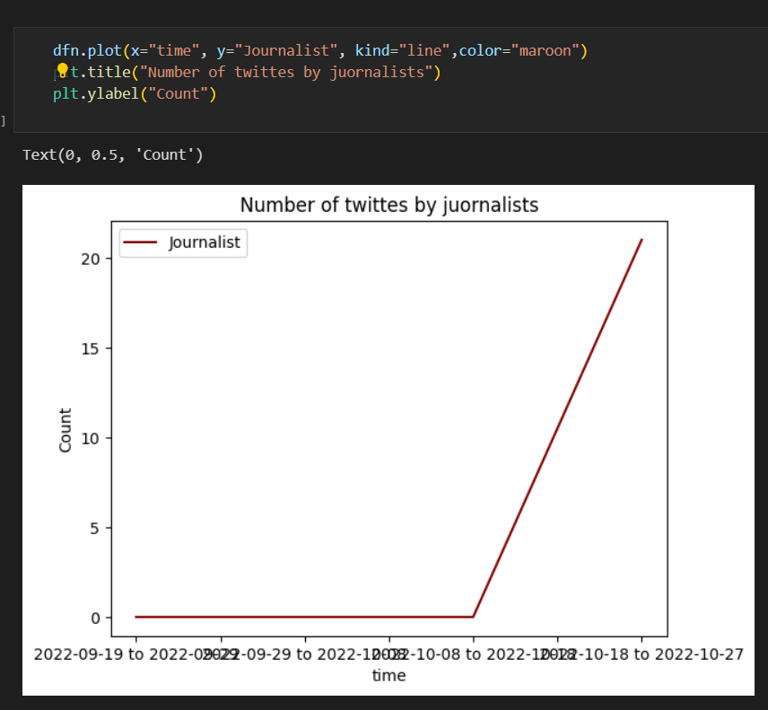
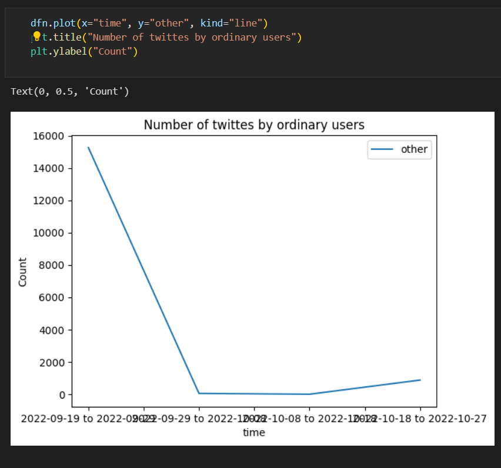
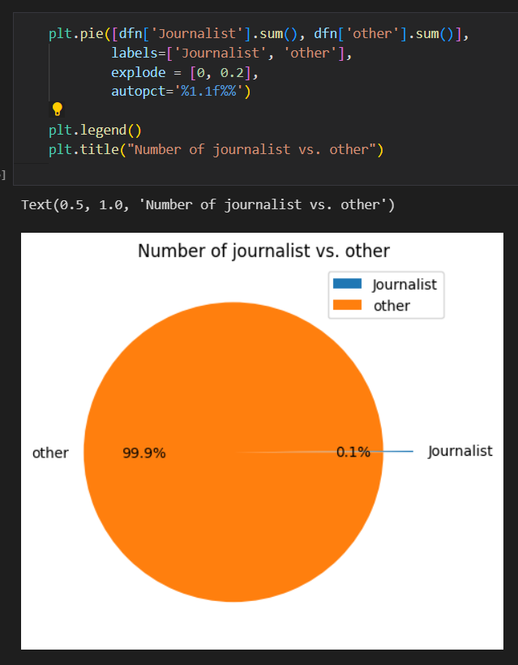

# Hashtag-MahsaAmini-Data-Analyst

Analyzed data of trended hashtag on Twitter :

* Twitter API query, Apify, Netlytic, TwitterScrape, Altimis/Scweet and twintproject/twint scraper were used to collect data, and as a result, the dataset has 17000 rows and 21 features.
* Use Streamlit to show the results of different parts of the project
* Had recognized 17.3% of people that use the trended hashtag in their tweets have signed up on Twitter after trending this hashtag.
* Compare number of tweets by ordinary user and juornalists:

